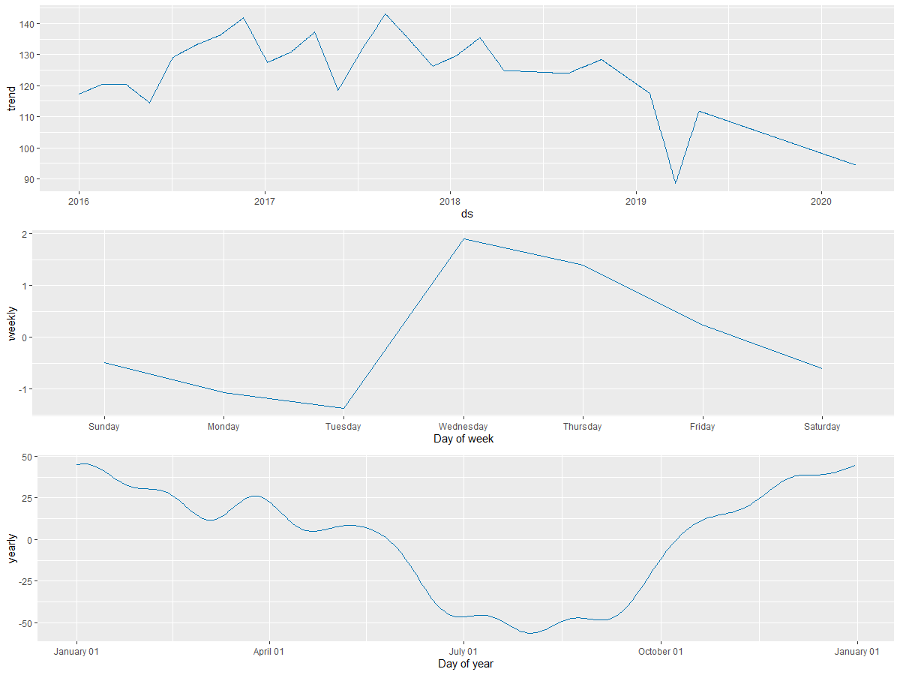
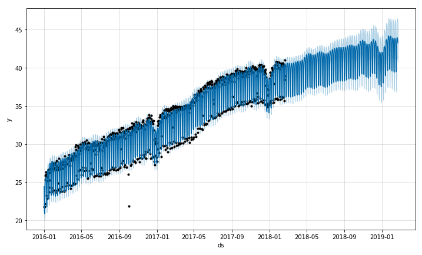

# PREDICTION & FORECASTING OF AIR QUALITY USING MACHINE LEARNING MODELS
### Features ✨

 - PM 2.5
 - PM 10
 - AQI
 - NO2
 - Temperature 
 - Pressure
 - Rainfall
 - Wind Speed

⚡️**Models for prediction:**
 - `Random Forest` - Accuracy of 0.941187 μ/m³
 - `XGBoost` - Accuracy of 0.7457792 μ/m³
 - `Deep Learning` - Accuracy of 0.9575909 μ/m³ 
 - `CatBoost` - Accuracy of 0.6030147 μ/m³
 

⚡️**Model for Forecasting:**
- `Prophet Introduced by Facebook`
 
 
 
 
`Prophet` - Accuracy of 24 AQI (RMSE)

 
 

🚀 **Interface Using shiny:**
_Shiny is an R package that makes it easy to build interactive web apps straight from R.it is used for showing the insight of the data and prediction._
### Collaborators <!-- ALL-CONTRIBUTORS-BADGE:START - Do not remove or modify this section -->
<!-- ALL-CONTRIBUTORS-BADGE:END -->

<!-- ALL-CONTRIBUTORS-LIST:START - Do not remove or modify this section -->
<!-- prettier-ignore -->
<table>
  <tr>
   <td align="center"><a href="https://github.com/grtvishnu"> <b>Vishnu Unnikrishnan</b></a> <a href="https://github.com/grtvishnu" title="Code">💻</a> <a href="#design-Grtvishnu" title="Design">🎨</a></td>
    <td align="center"><a href="https://github.com/sruthi026"> <b>Sruthy K S</b></a> <a href="https://github.com/sruthi026author=liyasthomas" title="Code">💻</a> <a href="#design-sruthy" title="Design">🎨</a></td>
    <td align="center"><a href="https://github.com/TESLINR"> <b>Teslin Rose</b></a> <a href="https://github.com/TESLINR" title="Code">💻</a> <a href="#design-Teslin" title="Design">🎨</a></td>
   <td align="center"><a href="https://github.com/vini1998"> <b>Vini</b></a> <a href="https://github.com/vini1998" title="Code">💻</a> <a href="#design-vini" title="Design">🎨</a></td>
   
 </tr>
</table>

   
  
   
  <h3>Happy Coding ❤︎</h3>

