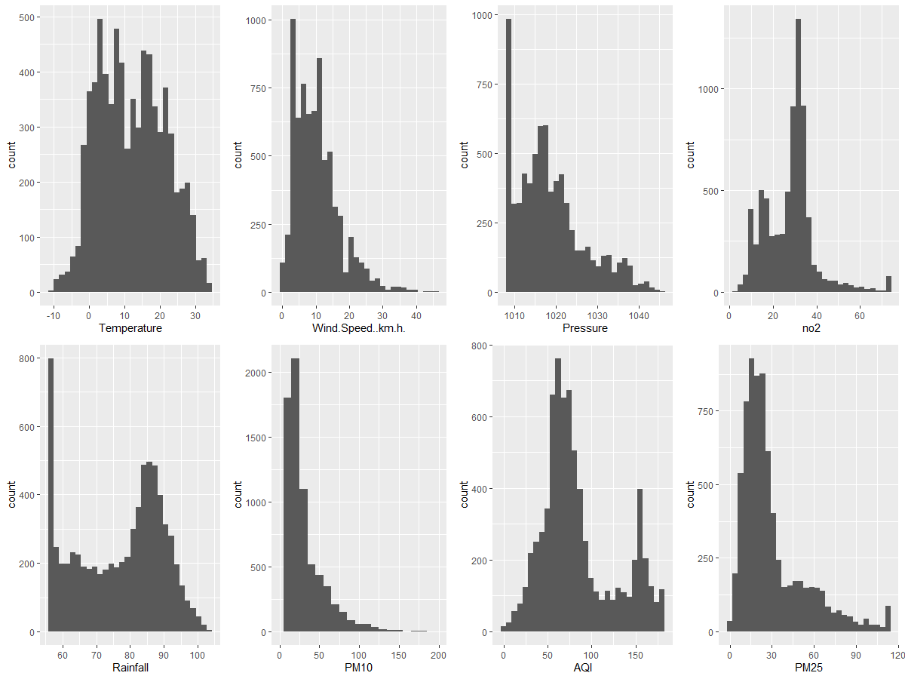
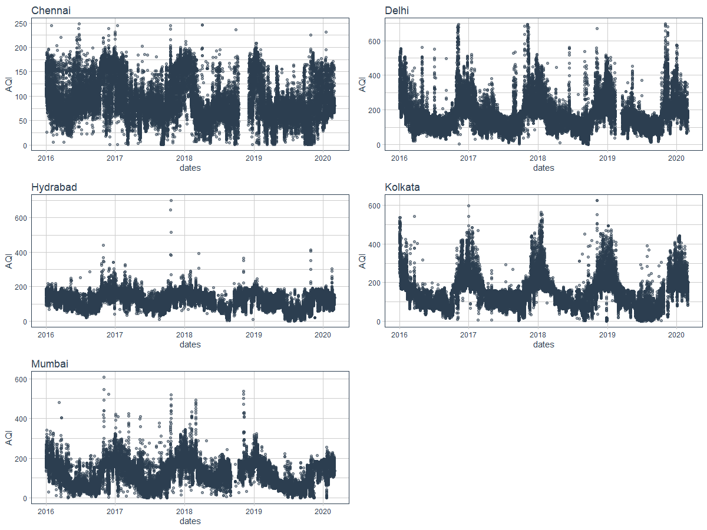
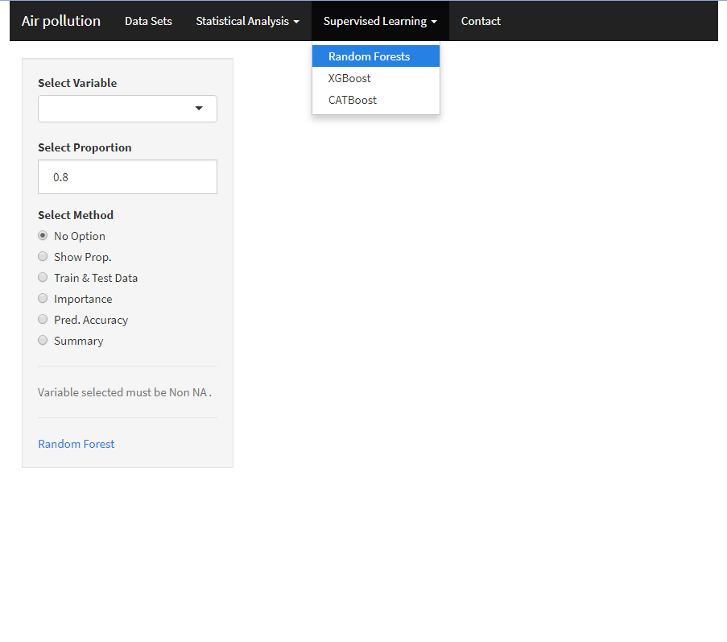

# AIR POLLUTION FORECASTING AND PREDICTION
### MODELS ✨

⚡️**Models for Prediction:**
 - `Random Forest` - Random forests or random decision forests are an ensemble learning method for classification, regression.
 - `XGBoost` - XGBoost is an open-source software library which provides a gradient boosting.
 - `Deep Learning` - Multilayer Perceptron, Deep learning is part of a broader family of machine learning methods based on artificial   neural networks with representation learning.
 - `CatBoost` - CatBoost is an open-source gradient boosting on decision trees library with categorical features support out of the box.

🌈**Models For Forecasting:**

 - `LSTM`- A Deep Learning method to find Future values of AQI upto 7 days 
 - `Prophet` - a package developed by facebook

🔥**Features:**
 - Temperature (°C)
 - Wind Speed (Km/h)
 - Pressure (Pa)
 - NO2 (ppm)
 - Rainfall (Cm)
 - PM10 (μg/m3)
 - PM2.5 (μg/m3)
 - AQI

📦 **Used Packages**
 1. caret
 2. tidyverse
 3. tidymodels
 4. randomforest
 5. xgboost
 6. data.table
 7. Hmisc
 8. catboost
 9. VIM
 10. Shiny
 ## Prediction Data 📝
 
 ## Forecast Data 📝
 
 
 ## Interface 🔮
 
🚀 **Interface Using shiny:**
_Shiny is an R package that makes it easy to build interactive web apps straight from R.it is used for showing the insight of the data and prediction._
### Collaborators <!-- ALL-CONTRIBUTORS-BADGE:START - Do not remove or modify this section -->
<!-- ALL-CONTRIBUTORS-BADGE:END -->

<!-- ALL-CONTRIBUTORS-LIST:START - Do not remove or modify this section -->
<!-- prettier-ignore -->
<table>
  <tr>
   <td align="center"><a href="https://github.com/grtvishnu"> <b>Vishnu Unnikrishnan</b></a> <a href="https://github.com/grtvishnu" title="Code">💻</a> <a href="#design-Grtvishnu" title="Design">🎨</a></td>
    <td align="center"><a href="https://github.com/sruthi026"> <b>Sruthy K S</b></a> <a href="https://github.com/sruthi026author=liyasthomas" title="Code">💻</a> <a href="#design-sruthy" title="Design">🎨</a></td>
    <td align="center"><a href="https://github.com/TESLINR"> <b>Teslin Rose</b></a> <a href="https://github.com/TESLINR" title="Code">💻</a> <a href="#design-Teslin" title="Design">🎨</a></td>
   <td align="center"><a href="https://github.com/vini1998"> <b>Vini</b></a> <a href="https://github.com/vini1998" title="Code">💻</a> <a href="#design-vini" title="Design">🎨</a></td>
   
 </tr>
</table>

   
  
   
  <h3>Happy Coding ❤︎</h3>

